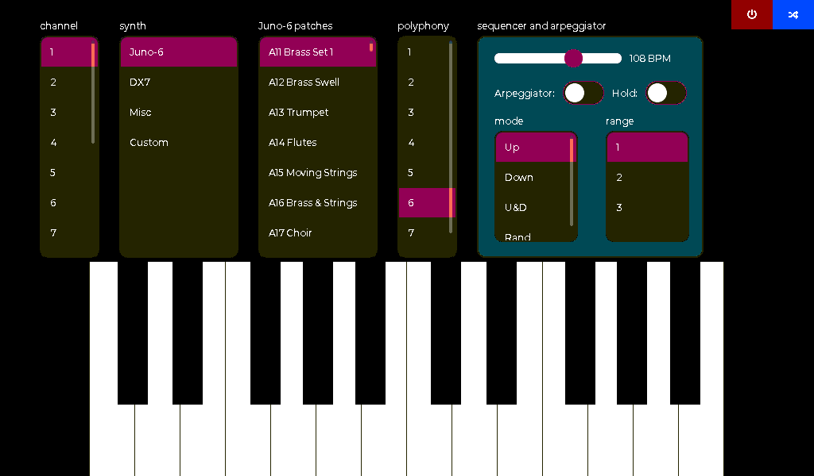
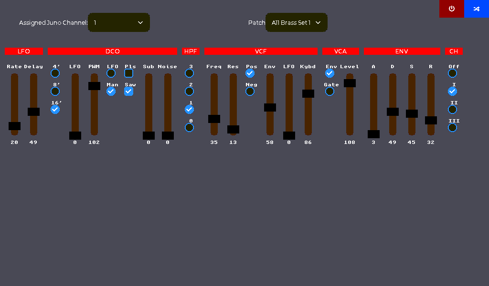
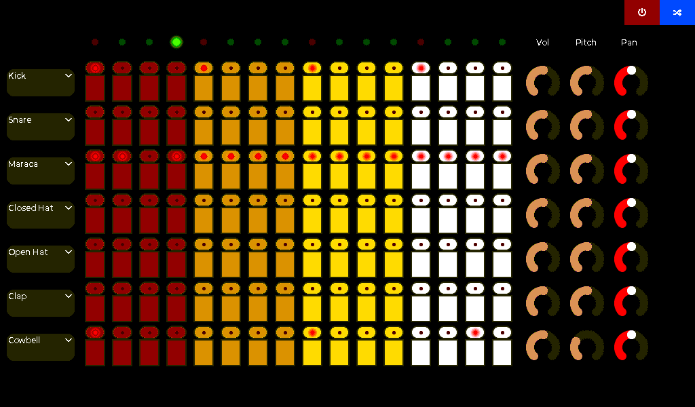
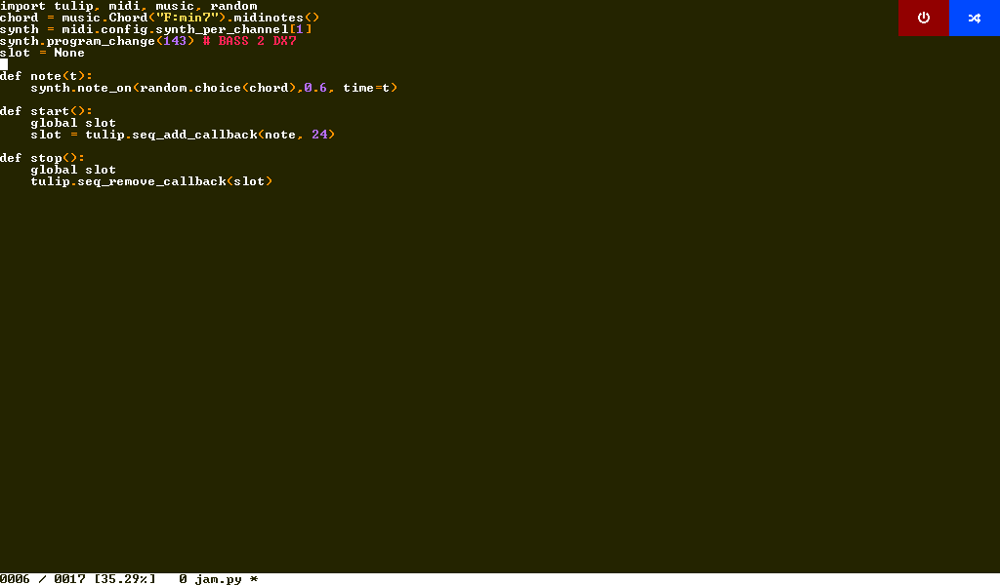

# Using Tulip to make music tutorial

Welcome to Tulip! 

This tutorial shows you all the ways to make music and make code to make music on Tulip. We'll update it as more examples, techniques and demos appear. 

First, make sure you've gone through the initial [getting started tutorial](getting_started.md). Especially, please make sure you've run `tulip.upgrade()`. 

## What Tulip is

Tulip is a **music computer** where everything about the underlying synthesis and sequencer engine can be programmed, live, on the Tulip itself. We provide a code editor and you can run programs right on Tulip, including multi-tasking apps that work together. We provide a few programs -- a patch editor, a place to assign voices, a drum machine -- but the real value of Tulip is the power to make whatever you imagine, or the programs contributed by others. 

## What Tulip can do with music 

 - Play very accurate Juno-6 patches and similar analog synths, up to 6 note polyphony / multimbrality. You have full control over all the parameters.
 - Play very accurate DX7 patches, and allow you to create your own FM synthesis setup -- in code!
 - Play built in 808-style drum patches, with pitch control 
 - Load in your own .WAV samples to use in a sampler
 - Control CV outputs for modular synths and analog synths, with built in waveforms and sample & hold 
 - Sample CV inputs from an ADC to control other events on Tulip 
 - Send MIDI in and out, from code. You can write code to respond to MIDI messages to do whatever you want
 - Share a common sequencer clock across multiple apps, for example, a drum machine and an arpeggiator 
 - Add global EQ, chorus or reverb to the audio output
 - A scale and chord library to define musical notes in code, e.g. `music.Chord("F:min")`
 - Have total low level control of all oscillators, specifying their filters, waveform, modulation sources, ADSRs


## The built-in Tulip synthesizer

When you start up your Tulip, it is configured to receive MIDI messages from the MIDI in port. You can plug in any MIDI device that sends MIDI out, like a MIDI keyboard or your computer running a sequencer. 

Try to just play notes once you've turned on Tulip, By default, MIDI channel 1 plays a Juno-6 patch. Notes on channel 10 will play PCM patches. 

You can adjust patch assignments per channel, or change patches, using our built in `voices` app. You can type `run('voices')` or tap the bottom right launcher menu and tap `Voices`. 



The red button on the top right will quit the app, and the blue button will switch to other apps, including the REPL (where you can type commands.)

Try changing the channel 1 patch to a different Juno-6 patch, or a DX-7 patch. You can also tap the keyboard on screen, even with multiple fingers. Try also playing with the arpeggiator. 

## The built-in Juno-6 patch editor

If you want to modify parameters of the Juno-6 synthesizer you can open `juno6`, either from the REPL or the launcher menu. While you have a Juno-6 patch assigned to a MIDI channel, you can modify any parameters of it, just like a real Juno-6. You can also assign MIDI control change values to a parameter, so that your MIDI keyboards sliders/knobs can control parameters.



## The Tulip sequencer and built-in drum machine

There's an 808-style drum machine that comes with Tulip, accessed via `run('drums')`. You can play back any PCM sample that ships on Tulip, or even load your own (see below.) The Tulip drum machine shares a common clock alongside any other Tulip program that uses a sequencer. This means that for example the arpeggiator in the `voices` app will stay in time with the drum machine. We'll show you how to control and use the sequencer in your own programs below.



Set up a nice drum sequence for a bit. Play with the pitch parameter and pan. Now, go back to the REPL with the "switch" icon, or by using `control-Tab`. The drum machine should still be playing!

Let's make some of our own Tulip code to play along! You can make programs with our editor or just write small functions in the REPL itself. Let's start there. What we want to do is play the notes of a chord randomly, but in time with the drum machine already playing.

First, let's grab the synth we'll be playing. Let's just use the default playing synth - the Juno-6 patch 0 on MIDI channel 1. If you changed it to something else, that's fine! While we're here, we'll also choose the chord we want to play. So just type

```python
import music, random
chord = music.Chord("F:min7").midinotes()
synth = midi.config.synth_per_channel[1]
```

The first `import music, random` tells Tulip that we'll be using those libraries. Some (like `tulip, amy, midi`) are already included on bootup, but it's a good habit to get into when writing programs. 

If you just type `chord` and enter, you'll see the contents - just a list of MIDI notes corresponding to F minor 7. And `synth` is an object you can send messages to do make tones. Try `synth.note_on(50, 0.5)` -- will play a MIDI note 50 at half volume. 

To set this up to play with the sequencer, we will add a **sequencer callback**.  This is just a simple Python function that will get called every sequencer "tick". You can customize how often the tick is called. We'll call ours every quarter note. But first, let's define the function that will get called. Type this into the REPL. Hit the `Tab` key for the line that have four spaces before the code to make an indent. Hit enter a few times at the end until you see a `>>>` prompt again (not a `...`.) 

```python
def note(t):
    synth.note_on(random.choice(chord), 0.6, time=t)
```

This function is called `note` and will tell our `synth` to play a random note of the `chord` at velocity 0.6 at time `t`. `random.choice(x)` just means to pull a random thing out of a list, like our list of midi notes. Don't worry about `time` right now, the sequencer takes care of it! This callback can do anything -- it can draw graphics, send or read MIDI events, send or read CV values from an external synth, do something on a Wi-Fi network change synth parameters, whatever you want. But we'll start with simply playing a note every quarter note.

For now, tell the callback to start:

```python
slot = tulip.seq_add_callback(note, 48)
```

You should now be hearing a synth pattern play every quarter note in time with the drums. It will keep going! The second parameter of `seq_add_callback` is the `divider` of the callback. This tells Tulip how often to call the callback. We send 48 ticks a quarter note. So giving `48` to the divider just means to call the function once a quarter note. We can instead call our `note` every 1/8th note by changing the divider to `24`:

```python
tulip.seq_remove_callback(slot) # the synth should stop 
slot = tulip.seq_add_callback(note, 24) # it should start in double time again
```

(If you want to do more complex things that aren't in even time, you can set your divider to `1` and it will be called every single tick (with roughly 10ms between ticks) and you can decide when to emit notes.)

The `slot` that gets returned by `seq_add_callback` is how you keep track of your callbacks. Every program on Tulip that uses the sequencer (like the drum machine, arpeggiator, etc) has its own callback slot. Your programs should end in a `tulip.seq_remove_callback(slot)`.

While you're playing with this, go back to the `voices` app and change the patch on channel 1 to something else. You'll hear your synth change immediately. You can also do this programatically: 

```python
synth.program_change(143) # change to patch #143 (dx-7 patch BASS 2)
```

You can also easily change the BPM of the sequencer -- this will impact everything using it, like the drum machine as well:

```python
tulip.seq_bpm(120)
```

## Making new Synths

We're using `midi.config.synth_per_channel[1]` to "borrow" the synth booted with Tulip. But if you're going to want to share your ideas with others, you should make your own `Synth` that doesn't conflict with anything already running on Tulip. That's easy, you can just run:

```python
synth = midi.Synth(2) # two note polyphony
synth.program_change(143)
```

And if you want to play multimbral tones, like a Juno-6 bass alongside a DX7 pad:

```python
synth1 = midi.Synth(1)
synth2 = midi.Synth(1)
synth1.program_change(0) # Juno
synth2.program_change(128) # DX7
synth1.note_on(50,1)
synth2.note_on(50,0.5)
```

Remember to `release` your synths when you're done with them
```python
synth1.release() # DOESNT EXIST YET, does all note-off and then clears the voice alloc 
synth2.release()
```

As you learn more about AMY (the underlying synth engine) you may be interested in making your own `Synth` subclasses in Python. See `midi.py`'s `PitchedPCMSynth` for an example. 

## The editor

You can get a lot done in the Tulip REPL just playing around. But you'll eventually want to save your creations and run them alongside other things. Let's start up the Tulip Editor and save your first program. You can go ahead and quit the drum machine if you want, and remember to run

```
tulip.seq_remove_callback(slot) # the synth should stop 
```

to stop your REPL sequencer callback.

Type `edit('jam.py')` (or whatever you want to call it.) You'll see a black screen open. This is the editor! You can use it like a computer's editor to save code. Just start typing, let's put our program in posterity:

```python
import tulip, midi, music, random

chord = music.Chord("F:min7").midinotes()
synth = midi.Synth(1)
synth.program_change(143) # DX7 BASS 2
slot = None

def note(t):
    synth.note_on(random.choice(chord), 0.6, time=t)

def start():
    global slot
    slot = tulip.seq_add_callback(note, 24)

def stop():
    global slot
    tulip.seq_remove_callback(slot)
    synth.release_voices()

```



Hit `control-X` to save this (you'll see a little asterisk `*` go away in the status bar) and then either `control-Q` to quit the editor or `control-Tab` to switch back to the REPL. Now, just:


```
import jam
jam.start() # should start playing
jam.stop() # will stop playing
```

This will be easier for you to edit your creations and try things out. Try different chords, patches, different sequences, etc. If you stopped the drum machine, you can restart it anytime and it will stay in time with your `jam`.

The drum machine itself is actually a simple Tulip program, written in Python. You can look at the code on your Tulip, or edit it and run your own version. You can go back to the REPL and run `edit('/sys/ex/my_drums.py')` -- this will open a copy of the drum machine you can edit. Try changing the color of the LED on line 12 to say, 9. Then save ('control-X'), then quit the running drum machine and open your version -- `run('my_drums')`. You should see the change! Check out the rest of the drum machine code. Most of it is UI setup, and then you can see it setting up a sequencer callback and sending off the drum messages every beat. 

## UIScreens

You may have noticed that the editor, the `voices` and `drums` app all have those buttons on the top right and their own screen, while your `jam.py` just runs in the REPL. That works for a lot of things, but maybe you want to build a UI or show status of your app on its own screen. To do that, we can easily adapt our simple program to be a Tulip `UIScreen` app like its big siblings. Let's make a `jam2.py` into a UIScreen with a slider for tempo. Open `edit('jam2.py')` (quit the editor and restart it if you're editing something else) and make it

```python
import tulip, midi, music, random

def note(t):
    global app
    app synth.note_on(random.choice(app.chord), 0.6, time=t)

def start(app):
    app.slot = tulip.seq_add_callback(note, 24)

def stop(app):
    tulip.seq_remove_callback(app.slot)
    app.synth.release_voices()

def run(screen):
    global app
    app = screen
    app.slot = None
    app.chord = music.Chord("F:min7").midinotes()
    app.synth = midi.Synth(1)
    app.synth.program_change(143) # DX7 BASS 2
    app.present()
    app.quit_callback = stop
    start(app)
```

Save this and then just `run('jam2')` from the REPL (you can omit the `.py` if you want.) You'll see a blank screen with the top right buttons and you should be hearing your sequence, started when the app starts. If you hit "switch" or `control-Tab` it will still be going. If you quit or `control-Q` the app, it will stop. That's the `quit_callback` being setup there. 

Let's add a UI component. Add a few lines to `run` so it looks like:

```python
def run(screen):
    global app
    app = screen
    app.slot = None
    app.chord = music.Chord("F:min7").midinotes()
    app.synth = midi.config.synth_per_channel[1]
    app.synth.program_change(143) # DX7 BASS 2
    bpm_slider = tulip.UISlider(tulip.seq_bpm()/2.4, w=300, h=25,
        callback=bpm_change, bar_color=123, handle_color=23)
    app.add(bpm_slider, x=300,y=200)
    app.present()
    app.quit_callback = stop
    start(app)
```

And also add a new function, above the `run(screen)`. This is the callback from when someone changes the bpm slider. In this function, we want to change the system BPM:

```python
def bpm_change(event):
    tulip.seq_bpm(event.get_target_obj().get_value()*2.4)
```

Now quit the `jam2` app if it was already running and re-`run` it. You should see a slider, and when you move it, the system BPM changes. The `2.4` you see in the code is because sliders return values between 0-100, and we convert that into BPMs of 0-240. You can add all sorts of UI elements. We provide a few classic ones like `UICheckbox` and `UIButton`. You should look at the source of `drums` and `voices` to see how they're built and [our API documentation for the full details.](tulip_api.md) How about a `UIText` entry box for people to type in the chord they want to play? 


```

pcm loading wave 
MIDI from code
amy low level 
store patches


import midi
synth = midi.Synth(2) # two voice polyhony
synth.program_change(10) # change to patch #10 (juno-6 patch)
synth.note_on(50, 127)


amy.start_store_patch()
amy.send(osc=0,wave=amy.SINE,chained_osc=1)
amy.send(osc=1,wave=amy.SAW_DOWN, amp="0.1,0,1,1")
amy.stop_store_patch(1024)
amy.send(voices='6', note=52, vel=1, load_patch=1024)


# To save RAM, you may want to downsample your WAVE files to 11025 or 22050Hz. We detect SR automatically.
patch = tulip.load_sample("flutea4.wav") # samples are converted to mono if they are stereo

# You can optionally tell us the loop start and end point (in samples), and base MIDI note of the sample.
patch = tulip.load_sample("flutea4.wav", midinote=81, loopstart=1020, loopend=1500)

# The patch number can now be used in the custom Tulip memory PCM sample player. 
# It has all the features of the AMY's PCM wave type.
amy.send(osc=20, wave=amy.CUSTOM, patch=patch, vel=1, note=50)

# You can load up to 32 custom PCM patches. Be careful of memory use. load_sample will return -1 if there's no more room.
# You can unload already allocated patches:
tulip.unload_patch(patch) # frees the RAM and the patch slot
tulip.unload_patch() # frees all allocated PCM patches


To send signals over CV on Tulip CC (hardware only):

amy.send(osc=100, wave=amy.SAW_DOWN, freq=2.5, vel=1, external_channel=1)
# external_channel = 0 - no CV output, will route to audio
# external_channel = 1 - 1st channel of the first connected GP8413
# external_channel = 2 - 2nd channel of the first connected GP8413
# external_channel = 3 - 1st channel of the second connected GP8413
# external_channel = 4 - 2st channel of the second connected GP8413

# Or just send CV signals directly using the m5dac2 library:
import m5dac2
m5dac2.send(volts, channel=0)


import m5adc
volts = m5adc.get()
```